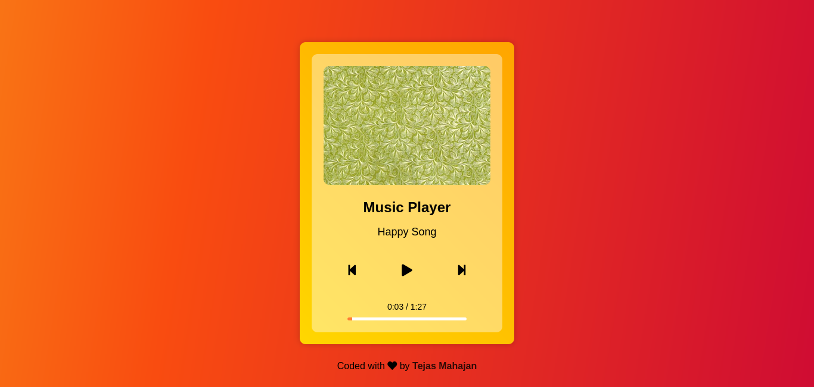

# Music Player

A simple and visually appealing music player web application created using HTML, CSS, and JavaScript. Play your favorite songs with a beautiful user interface. Powered by Unsplash for dynamic album cover art.

## Features

- Play and pause music
- Navigate between songs
- Visual progress bar with time display
- Dynamic album cover art from Unsplash
- Responsive design for various screen sizes

## Demo

You can try the Music Player live at [Demo Link](https://your-demo-link.com).

## Usage

Click the play/pause button to control playback.
Use the previous and next buttons to navigate between songs.
See the progress of the current song on the progress bar.
Enjoy beautiful album cover art fetched from Unsplash.

## Contributing

Contributions are welcome! Feel free to open issues and pull requests.

## Acknowledgments

Thanks to Unsplash for providing stunning album cover images.

## Author
[Tejas Mahajan]("https://github.com/tejas242")
